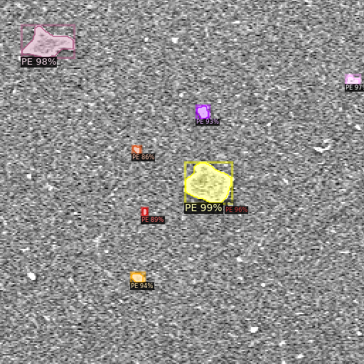
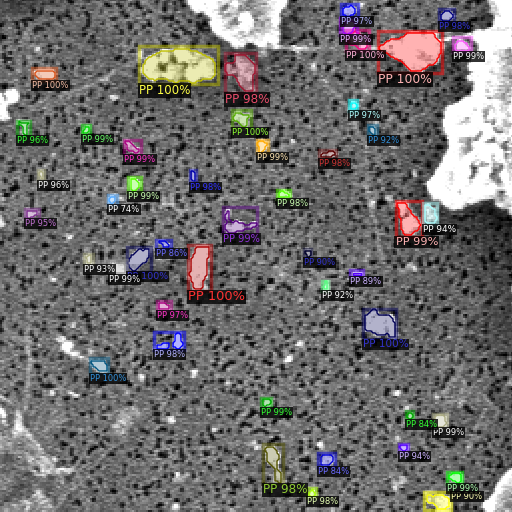
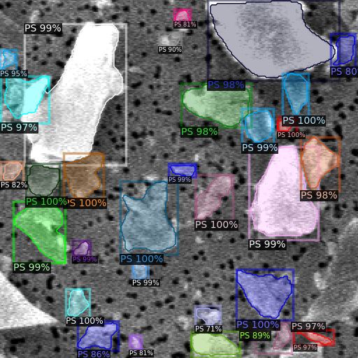
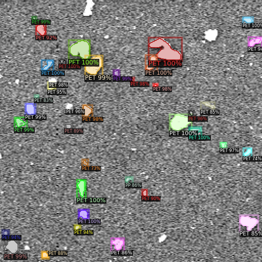
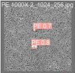
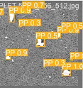
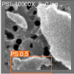
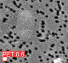

# MiNa: A Dataset of Micro/Nano Plastic SEM Images

This repository contains the MiNa dataset, which consists of Scanning Electron Microscope (SEM) images of micro and nano plastics. We have used YOLOv10, Faster R-CNN, and Mask R-CNN to benchmark this dataset. You can download the dataset using the following link:

[Download MiNa Dataset](https://drive.google.com/drive/folders/1FSic90KWf_bkYo99IzO3QHRbsC2EXfZk?usp=drive_link)

## Region-Based Networks

We use the Detectron2 library to implement Faster R-CNN and Mask R-CNN. The JSON files for these networks are in COCO format and are included in the drive. Both the detection and classification codes include modules that generate patches and randomly distribute them into training, validation, and test sets. If you want to use the same patches, comment out the patch generation function.

### Sample outputs 

  
  
   
  
  

## YOLOv10 Implementation

Follow this [link](https://github.com/THU-MIG/yolov10) to install YOLOv10.

You can download images and their annotations in YOLO format from the drive. There is also code to develop new patches. You can generate patches for both detection and classification using the included codes. Additionally, you will need to set a YAML file in the `cfg` directory of the Ultralytics package that contains the directory of your dataset.

### Sample outputs 

  
  
   
  
  

## Getting Started

1. **Download the Dataset**: Use the link above to download the dataset.
2. **Install Dependencies**: Follow the instructions in the YOLOv10 and Detectron2 repositories to install the required dependencies.
3. **Run the Code**: Use the provided scripts to generate patches and train your models.

## Contributing

Feel free to open issues or submit pull requests if you have any suggestions or improvements.

## License

This project is licensed under the MIT License - see the [LICENSE](LICENSE) file for details.
